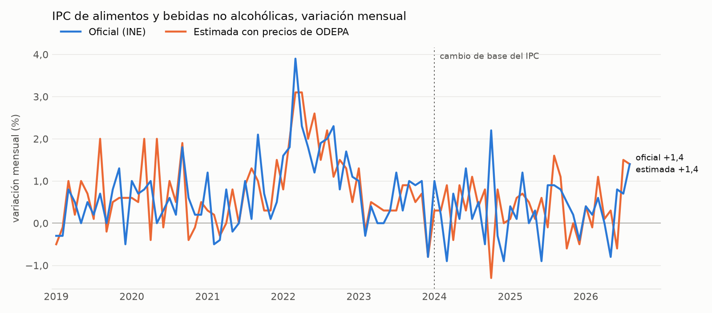

# IPC de alimentos y canasta básica con precios de ODEPA: prueba hacia atrás

Pregunta: ¿puede Carestía publicar cada semana una estimación del IPC de alimentos y una valorización de la Canasta Básica de Alimentos con los precios al consumidor de ODEPA? Esta prueba hacia atrás mide qué tan bien lo habría hecho entre enero de 2019 y agosto de 2026, y la decisión sale de una prueba fuera de muestra (2024 a 2026) con una regla fijada antes de ver los resultados. Es solo análisis: no cambia el sitio ni el pipeline. Cómo reproducirlo, en [README.md](README.md).

## Respuesta corta

**Ningún producto pasa la regla.** Ni la estimación semanal del IPC de alimentos (en ninguna de sus cuatro versiones) ni la canasta básica anclada le ganan al mejor comparador simple, y ninguna acierta la dirección más que "siempre sube". Falla con 1, con 2 y con 3 semanas del mes.

- **IPC de alimentos.** De enero de 2024 a agosto de 2026, el mejor comparador fue el promedio de 12 meses del propio IPC de alimentos, con un error de 0,58 puntos. Las cuatro versiones tienen más error: entre 0,60 y 0,80. Aciertan la dirección en 16 a 20 de 32 meses, contra 23 de "siempre sube".
- **Canasta básica anclada.** Valor oficial del mes anterior más la variación ODEPA del mes: error de 0,56 a 0,62 puntos, contra 0,44 del promedio de 12 meses. Acierta la dirección en 17 a 19 de 32 meses, contra 25 de "siempre sube".
- **Canasta básica valorizada con ODEPA.** Se puede calcular, pero es otra medida: en agosto de 2026 vale 88.255 pesos por persona, 4,4% bajo los 92.327 que publicó el Ministerio.

## La regla y la prueba fuera de muestra

La regla, las versiones y los períodos quedaron escritos en [preregistro.md](preregistro.md) y subidos al repositorio el 5 de octubre de 2026 a las 18:26 (UTC), antes de calcular cualquier resultado de 2024 a 2026; no se cambió nada después. La regla principal (V0) y la versión con promedio de 12 meses (V2) ya se habían medido en todo el período en la versión anterior de este informe, así que sus cifras de 2024 a 2026 no eran ciegas; el AR(1), la combinación y la canasta anclada sí.

- **Regla.** El error absoluto medio de la variación mensual tiene que ser menor que el del mejor comparador simple (el de menos error entre el ingenuo, que repite la variación oficial del mes anterior, y el promedio de las variaciones oficiales de los 12 meses anteriores), con una diferencia significativa en la prueba de Diebold y Mariano (p < 0,05). Además, tiene que acertar la dirección (sube, baja o 0,0) en más meses que "siempre sube". Como se publicaría cada semana, un producto pasa solo si cumple con 1, 2 y 3 semanas del mes.
- **Períodos.** Desarrollo: 2019 a 2023, donde se estiman los parámetros. Prueba: enero de 2024 a agosto de 2026 (32 meses), sin tocar nada.
- **Versiones del IPC.** Cambian en cómo se proyecta lo que no tiene variación ODEPA ese mes. V0: su variación del mes anterior (la regla principal). V1: un AR(1) alrededor de su promedio de 12 meses, con un coeficiente estimado en desarrollo (φ = -0,30: lo que no tiene ODEPA tiende a devolver parte de lo que se movió el mes anterior). V2: su promedio de 12 meses. V3: la estimación V0 combinada con el promedio de 12 meses de Alimentos, con el peso estimado en desarrollo (0,65, 0,56 y 0,61 para V0 con 1, 2 y 3 semanas).
- **Canasta anclada.** Valor oficial de cada producto el mes anterior, movido con su variación ODEPA del mes; lo que no tiene ODEPA, con el promedio de 12 meses de la variación oficial de la canasta. Se compara con la variación mensual oficial.
- **Semanas.** Con k semanas, la variación de cada producto ODEPA compara las primeras k semanas del mes con las mismas del mes anterior.

### IPC de alimentos, enero 2024 a agosto 2026 (32 meses)

| Versión | Error con 1 semana | 2 semanas | 3 semanas | Meses con la dirección correcta (1, 2 y 3 semanas) |
|---|---|---|---|---|
| V0 regla principal | 0,76 (p = 0,10) | 0,73 (p = 0,09) | 0,80 (p = 0,04, peor) | 17, 17 y 18 |
| V1 AR(1) | 0,70 (p = 0,23) | 0,67 (p = 0,28) | 0,68 (p = 0,30) | 18, 16 y 19 |
| V2 promedio de 12 meses | 0,67 (p = 0,35) | 0,66 (p = 0,35) | 0,67 (p = 0,35) | 18, 17 y 19 |
| V3 combinación | 0,64 (p = 0,42) | 0,60 (p = 0,79) | 0,65 (p = 0,37) | 19, 20 y 19 |
| Mejor comparador: promedio de 12 meses | 0,58 | 0,58 | 0,58 | "siempre sube": 23 |

El ingenuo tuvo un error de 0,91. El p es el de Diebold y Mariano contra el promedio de 12 meses. "Peor" quiere decir que la estimación tiene significativamente más error que el comparador.

### Canasta básica anclada, enero 2024 a agosto 2026 (32 meses)

| | Error con 1 semana | 2 semanas | 3 semanas | Meses con la dirección correcta (1, 2 y 3 semanas) |
|---|---|---|---|---|
| Canasta anclada | 0,62 (p = 0,09) | 0,56 (p = 0,16) | 0,60 (p = 0,11) | 19, 17 y 19 |
| Mejor comparador: promedio de 12 meses | 0,44 | 0,44 | 0,44 | "siempre sube": 25 |

El ingenuo tuvo un error de 0,71. Antes de 2026 la variación oficial es la de la canasta reconstruida con la regla del Ministerio (ver más abajo).

Lo que muestran las dos tablas:

- Todo queda del lado equivocado: más error que el comparador y menos aciertos de dirección que "siempre sube". Como ninguna versión tiene menos error que el comparador, la corrección por hacer 15 pruebas no cambia nada.
- En desarrollo la combinación sí le ganaba al promedio de 12 meses (0,47 a 0,49 contra 0,66, p = 0,01), pero con un peso estimado en esos mismos años. Fuera de muestra la ventaja desaparece.
- Con el mes completo, que no cuenta para la regla, el resultado es el mismo: el mejor queda en 0,60 (V1) contra 0,58 del comparador, y la canasta anclada en 0,52 contra 0,44 ([evaluacion.csv](resultados/evaluacion.csv)).

## Cobertura

| | Productos con ODEPA | Peso cubierto |
|---|---|---|
| IPC de alimentos, base 2018 (2019 a 2023) | 35 de 76 | 61,1% |
| IPC de alimentos, base 2023 (desde 2024) | 35 de 81 | 58,5% |
| Canasta básica, metodología 2024 | 36 de 96 | 60,7% del valor |

Mes a mes, la parte que efectivamente se mueve con ODEPA promedia 60,9% en la base 2018 y 56,9% en la base 2023 (el yogur de 125 g, por ejemplo, dejó de cotizarse en julio de 2023). Quedan fuera, entre otros, cecinas, bebidas, agua embotellada, pescados, galletas, repostería, platos preparados, café y pan envasado. En la canasta, además, las comidas en restaurantes (7,5% del valor) y lo que ODEPA cotiza por unidad y no por kilo (huevos, lechuga, choclo, pepino, pimentón, zapallo italiano, brócoli y ajo). Los mapas ([mapa_productos.csv](mapa_productos.csv) y [mapa_cba.csv](mapa_cba.csv)) se revisaron contra lo que el INE efectivamente cotiza (microdatos, manuales y CCIF 2018.CL) y cada cambio pasó por dos escépticos. Por eso, en frutas y verduras de estación solo quedan las que el INE cotiza: salieron, entre otras, arándano, cereza, mandarina, mango, apio y haba.

## Método

- **Agregación.** Laspeyres con las ponderaciones del INE, la misma fórmula del índice oficial. Aplicada a los índices oficiales de producto, reproduce la variación publicada de Alimentos en 91 de 92 meses (en el otro difiere en 0,1 por redondeo).
- **Productos con ODEPA.** Media geométrica de la variación de sus productos ODEPA en la Región Metropolitana (cada uno, media de sus series por unidad), con la limpieza de las series del sitio.
- **Productos sin ODEPA.** Su propia variación oficial del mes anterior (regla principal), o una de las otras versiones de la prueba fuera de muestra. Todo lo que usan ya estaba publicado.
- **Sin mirar al futuro.** Para cada mes solo entran las semanas de ODEPA publicadas antes de la fecha del IPC, sacada de la portada de cada boletín del INE ([calendario_ipc.csv](calendario_ipc.csv)). El INE no revisó ninguna cifra de alimentos después de publicarla.
- **Cambio de base.** Base 2018 hasta diciembre de 2023 y base 2023 desde enero de 2024. En enero de 2019 y enero de 2024 el INE ya había publicado la canasta nueva, pero no los índices de sus productos en el año base. Esos dos meses van con las ponderaciones sin reescalar y los productos sin ODEPA con la variación oficial de Alimentos. Esa aproximación mueve la cifra en 0,1 a 0,2 puntos por sí sola.
- **Comparación.** La estimación se redondea a un decimal, como la publica el INE. Dirección: sube, baja o 0,0. Significancia: prueba de Diebold y Mariano con la corrección de Harvey, Leybourne y Newbold.

## Resultados de 2019 a 2026 con la regla principal (mes completo)

| Año | Error estimación | Error ingenuo | Dirección estimación | Dirección ingenuo |
|---|---|---|---|---|
| 2019 | 0,48 | 0,62 | 75% | 50% |
| 2020 | 0,67 | 0,61 | 58% | 75% |
| 2021 | 0,62 | 0,96 | 75% | 58% |
| 2022 | 0,64 | 0,85 | 100% | 100% |
| 2023 | 0,29 | 0,61 | 83% | 58% |
| 2024 | 1,12 | 1,29 | 50% | 50% |
| 2025 | 0,57 | 0,71 | 58% | 50% |
| 2026 (a agosto) | 0,53 | 0,65 | 50% | 50% |
| **Total (92 meses)** | **0,62** | **0,79** | **69,6%** | **62,0%** |

Error: error absoluto medio de la variación mensual, en puntos porcentuales. Con la regla anterior (ganarle al ingenuo y acertar la dirección en 2 de cada 3 meses) la estimación pasaba. Con la regla nueva no, porque el promedio de 12 meses tiene casi el mismo error en todo el período (0,63) y "siempre sube" acierta la dirección en 75% de los meses.

¿De dónde sale el error? Si a los productos con ODEPA se les pone la variación del INE en vez de la de ODEPA, el error baja de 0,62 a 0,39. La mayor parte viene de que la variación de ODEPA en la RM no es la que mide el INE en el país. Los productos que más error aportan son pan, frutas de estación, carne de vacuno y pollo, todos con ODEPA. Entre los que no tienen ODEPA pesan las bebidas gaseosas y las cecinas ([aporte_error_productos.csv](resultados/aporte_error_productos.csv)).

## Canasta básica

La canasta vigente (metodología 2024) son 96 productos con su cantidad mensual por persona, valorizados a marzo de 2022 en 66.896 pesos. El Ministerio la reajusta con el promedio ponderado del IPC de alimentos y del de restaurantes, nacional. Esa regla reconstruye lo publicado en 2026 con un error máximo de 0,02%. Antes de 2026 el Ministerio publicaba otra canasta (metodología 2013), que no es comparable, así que de 2019 a 2025 la comparación va contra la reconstrucción.

Con ODEPA, cada producto parte de su precio promedio de marzo de 2022 y desde ahí se mueve con la variación de sus series ODEPA. Así un cambio de formato (el yogur pasó de vaso a bolsa de 1 kilo en julio de 2023) o una fruta fuera de temporada no se leen como cambio de precio. Lo que no tiene ODEPA queda con el valor del Ministerio, para que toda la diferencia quede en los productos con ODEPA. La última columna es la cifra que se podría publicar al cerrar cada mes: lo que no tiene ODEPA va con el valor del Ministerio del mes anterior, porque el del mes recién sale con el IPC.

| Mes | Ministerio | Con ODEPA | Diferencia | Solo productos con ODEPA | A fin de mes |
|---|---|---|---|---|---|
| diciembre 2019 | 55.280 | 53.081 | -4,0% | -6,5% | -3,9% |
| diciembre 2021 | 62.790 | 62.253 | -0,9% | -1,4% | -1,1% |
| marzo 2022 (base) | 66.896 | 66.697 | -0,3% | -0,5% | -1,6% |
| diciembre 2023 | 81.599 | 81.714 | +0,1% | +0,2% | +0,3% |
| diciembre 2025 | 89.233 | 84.832 | -4,9% | -8,1% | -4,9% |
| agosto 2026 | 92.327 (publicado) | 88.255 | -4,4% | -7,3% | -4,9% |

La diferencia tiene dos partes:

1. **Nivel.** En marzo de 2022 los productos con ODEPA suman casi lo mismo que en la canasta (-0,5%), pero producto a producto las brechas son grandes y se compensan. En ODEPA el pollo cuesta cerca de 40% menos, la posta 36% menos y el plátano 42% menos, mientras que los espaguetis cuestan 146% más, las papas 25% más y el pan corriente 12% más. La canasta parte del gasto de los hogares del primer quintil en la Encuesta de Presupuestos Familiares (marcas, formatos y lugares de compra reales), y ODEPA cotiza un formato fijo en ferias y supermercados de la RM.
2. **Movimiento.** El Ministerio mueve los 96 productos con un solo índice nacional que incluye restaurantes. Los precios ODEPA de los productos cubiertos subieron más que ese índice entre 2019 y 2022 y menos desde 2024. La variación mensual de las dos canastas difiere en 0,43 puntos en promedio (0,53 en la versión de fin de mes).

## Licencias

- **INE:** [CC BY-SA 4.0](https://www.ine.gob.cl/terminos-de-uso-y-licencia-de-datos-abiertos). Lo que se publique a partir de sus series tiene que citar al INE, enlazar la licencia, decir qué se cambió, ir bajo la misma licencia y no dar a entender que la estimación es del INE.
- **Canasta básica:** el Observatorio Social del Ministerio de Desarrollo Social y Familia no declara licencia en sus páginas ni en los PDF ([metodología 2024](https://observatorio.ministeriodesarrollosocial.gob.cl/storage/docs/casen/2024/Metodologia_de_Medicion_de_la_Pobreza_por_Ingresos_2024.pdf), [informes mensuales](https://observatorio.ministeriodesarrollosocial.gob.cl/nueva-serie-cba-2026)). Es información pública (Ley 20.285). Lo prudente es citar "Fuente: Ministerio de Desarrollo Social y Familia" y aclarar que la valorización con ODEPA es elaboración propia.
- **ODEPA:** [CC BY 4.0](https://datos.odepa.gob.cl/manual/terminos-y-condiciones.pdf).

## Conclusión

**Ningún producto pasa la regla.** En la prueba de 2024 a 2026, con 1, 2 y 3 semanas, ni la estimación del IPC de alimentos (V0, V1, V2 ni V3) ni la canasta básica anclada tienen menos error que el promedio de 12 meses, y ninguna acierta la dirección en más meses que "siempre sube". No recomiendo publicar ninguna de las dos como estimación.

Lo que sí se puede publicar, presentado como tal y no como anticipo de una cifra oficial:

- la variación de precios ODEPA de los productos del IPC que ODEPA cubre en la RM;
- la canasta básica valorizada con precios de ferias y supermercados de la RM, con el valor del Ministerio al lado. Cubre el 61% del valor, mide la RM y no el país, y en 2026 queda entre 4% y 5% bajo lo publicado.

Límites de la prueba:

- El período de prueba es corto (32 meses) e incluye 2024, el año con más error de toda la serie.
- ODEPA mide la RM y el INE el país.
- Se supone que ODEPA publica cada semana el viernes.
- Los precios de ODEPA son la copia del 5 de octubre de 2026. El portal volvió a subir todos sus archivos el 25 de marzo de 2026, y el de 2025 otra vez el 29 de abril, así que no se puede saber si cambió datos ya publicados. Para medirlo habría que guardar una copia de cada semana.
- La cobertura por kilo deja fuera productos de peso en la canasta, como los huevos.
